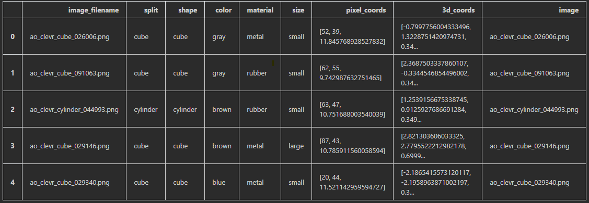
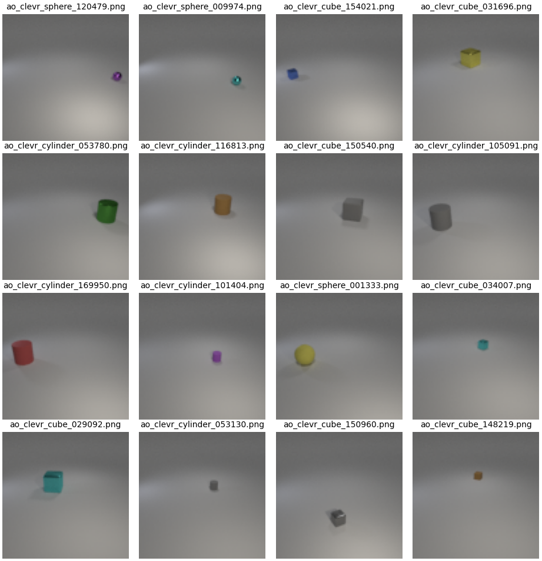

# Usage of normalizing flows to generate images of given attributes

## Authors
- Artur Kasymov
- Daniel Dobrowolski
- Ewelina Jamrozik
- Przemysław Przybysz

## Description
We want to use Proptypes to generate / modify images.
We focused on simple images from the AO-CLEVR dataset.

## Dataset
AO-CLEVr is a synthetic-images dataset created by NVIDIA. Images are created to "easy" Attribute-Object categrosies, based on the CLEVr framwork (Johnson et al. CVPR 2017).

Each object has several attributes:

- Shape [sphere, cube, cylinder]
- Color [red, purple, yellow, blue, green, cyan, gray, brown]
- Size [small, large]
- Material [rubber, metallic]
- Random position
- Random light

Each **Shape** X **Color** pair consists of ~7,500 images.

Samples: 

# Sources

- <a href="https://arxiv.org/pdf/1807.03039.pdf">Glow: Generative Flow with Invertible 1×1 Convolutions</a>

- <a href="https://arxiv.org/pdf/2106.00305.pdf">Independent Prototype Propagation
for Zero-Shot Compositionality
</a>

- <a href="https://proceedings.neurips.cc/paper/2019/file/adf7ee2dcf142b0e11888e72b43fcb75-Paper.pdf">This Looks Like That: Deep Learning for
Interpretable Image Recognition
</a>

- <a href="https://paperswithcode.com/dataset/ao-clevr">AO-CLEVr (Dataset)</a>

- <a href="https://drive.google.com/drive/folders/1BBwW9VqzROgJXmvnfXcOxbLob8FB_jLf"> One object AO-CLEVr (Dataset)</a> - <a href="https://github.com/NVlabs/causal_comp"> [Github] </a>
